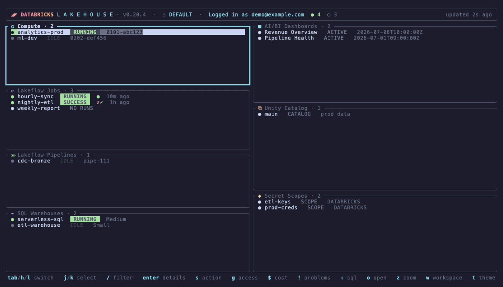

# databricks-tui

[](https://github.com/pjhamera/databricks-tui/actions/workflows/ci.yml)
[](https://crates.io/crates/databricks-tui)
[](https://github.com/pjhamera/databricks-tui/releases/latest)
[](https://crates.io/crates/databricks-tui)
[](https://github.com/pjhamera/databricks-tui/blob/master/LICENSE)

Terminal dashboard for Databricks — monitor compute, jobs, pipelines, SQL warehouses, dashboards, and Unity Catalog in one view.

**[→ pjhamera.github.io/databricks-tui](https://pjhamera.github.io/databricks-tui/)**



> Community project — not affiliated with, endorsed by, or supported by
> Databricks, Inc. It drives the official [Databricks CLI](https://docs.databricks.com/dev-tools/cli/)
> with your own credentials; nothing is sent anywhere except your workspace.

- Animated splash screen and a Databricks-branded look: product-named panes
  (Compute, Lakeflow, SQL Warehouses, AI/BI Dashboards), status chips, and
  refresh flashes when new data lands
- Five color-coded panes that populate independently as each data source responds
- Jobs show their latest run result and a `✓✗✓` history strip, not just the config
- Health summary in the header: running / pending / failed / idle counts at a glance
- Active work floats to the top of every pane: running clusters, jobs and
  warehouses first, then pending, failures, finished, idle
- Grep any pane with `/`: filter by name, detail text or status
  (`/running` shows only running things)
- Drill into any item: formatted key facts and recent activity, raw JSON one key away
- Debug Lakeflow without the browser: drill from a job into any run
  (per-task states, durations, the actual error output of failed tasks)
  or from a pipeline into any update (state, cause, event-log entries
  with failures highlighted); live runs refresh themselves every few seconds
- SQL console (`:`): type a statement — syntax-highlighted as you
  type — run it on a warehouse, page through
  results — the whole lakehouse is queryable from the dashboard; with a
  table/view selected in the catalog pane, the prompt opens pre-filled with
  `SELECT * FROM catalog.schema.table LIMIT 100`, ready to edit; ↑/↓ cycle
  through past statements (persisted in ~/.config/databricks-tui/history),
  Ctrl+R searches them incrementally, Ctrl+X composes multi-line SQL in
  your $EDITOR, and Ctrl+S exports results to CSV — previews export with `e`;
  Tab completes catalog, schema, table and column names straight from Unity
  Catalog (plus SQL keywords), fetched lazily and cached for the session
- Problems view (`!`): everything currently failing across all panes in
  one list, with Enter jumping straight to the culprit — and when a new
  failure appears between refreshes, the footer flashes it (with a
  terminal bell) the moment it happens; every other workspace in
  ~/.databrickscfg is scanned in the background too, failures elsewhere
  show up tagged with their profile, and Enter on one switches you
  straight into that workspace
- Command palette (`Ctrl+P`): fuzzy-search every loaded resource across
  panes and jump straight to it
- Cancel from where you stand: `s` in a run/update view cancels it, and
  Esc on a running SQL statement cancels it server-side instead of
  leaving it burning the warehouse
- Debug failed runs without leaving the terminal: `o` in a run view
  shows every task's full error, stack trace and log tail — colorized,
  with error lines red, warnings yellow and timestamps dimmed — and `r`
  repairs the run, rerunning only the tasks that failed; on a running
  run the output view keeps tailing, so errors stream in as tasks finish
- Run timeline (`t` in a run view): every task's execution window as a
  Gantt bar on a shared time axis, colored by state — see at a glance
  what ran in parallel and which task ate the runtime
- Task DAG (`d` in a run view): the run's tasks as a dependency tree,
  each under the task it waits for, colored by state
- Run-history grid (`g` in a run view): every task's state across the
  job's recent runs as a matrix — a flaky task shows as scattered ✗ in
  one row, a broken job as a red column — with a duration sparkline per
  task and a `▲1.6×` flag when the latest run is well above its median
- Running-long detection: a live run that has already taken 1.5× the
  median of its recent successful runs gets an amber `⚠ 2.5× usual` tag
  in the jobs pane, a line in the problems view and a one-time bell —
  hung runs sit there looking green; this is what spots them
- Watch a run (`W` in a run view): keep doing other things and get a
  terminal bell + flash the moment it finishes, success or failure —
  a `👁` counter in the header shows what's being watched
- Upcoming runs (`u`): every job that will run again on its own — cron
  schedules, periodic and file-arrival triggers, continuous jobs —
  sorted by next fire time with countdowns, and `⏱ in 27m` shown right
  in the jobs pane
- Wide tables stay readable: previews render natural column widths and
  page with `←`/`→`, `/` filters columns by name, and `v` flips to a
  record view (one row, fields stacked) — the way through a
  500-column table; SQL results page with `Shift+←`/`→`
- Act on resources: start/stop clusters, warehouses and pipelines, trigger
  job runs — and `S` pauses/resumes a job's schedule or trigger in place,
  with `⏸ paused` shown right in the jobs pane
- Trigger with parameters: `p` on the run confirm opens a prompt
  prefilled with the job's current parameter defaults — edit
  `key=value` pairs and run; sent as job parameters or notebook
  params, whichever the job uses
- Inspect access: effective Unity Catalog grants (with inheritance) and
  workspace object ACLs for any selected item
- Warehouse details include recent query history: who ran what, how long
- DBU usage view scoped to the current workspace: 14 days of
  system.billing.usage as color-stacked daily
  bars, bucketed by SKU family (Jobs / SQL / All-Purpose / DLT), with
  list-price dollar estimates when system.billing.list_prices is readable,
  and a top-spenders table naming the jobs/clusters/warehouses behind the DBUs
- Table lineage as a tree: up to 3 hops upstream and downstream from
  system.access.table_lineage, rendered with branch guides so you can
  follow a table's ancestry at a glance
- Jump to any resource in the workspace web UI with one key
- Browse Lakeview dashboards: pages, widgets and datasets at a glance
- Unity Catalog browser: drill from catalogs into schemas, tables, views and
  volumes — and into the volumes themselves, browsing files and directories
  with sizes and ages, with Enter showing the head of any text file; table
  details include the full column schema plus size, file count, format and
  last-modified from DESCRIBE DETAIL, and `p` previews sample rows
- Arrange the dashboard your way: `H` hides and reorders panes, the grid
  adapts to what's visible, and the arrangement persists across sessions
- `?` shows every keybinding, grouped by context, lazygit-style
- Secret scopes pane: browse scopes and keys (with last-updated), create
  scopes, add secrets (values masked while typing, never displayed),
  delete with confirmation, and inspect scope ACLs with `g`
- Switch between workspaces (CLI profiles) without restarting
- Zoom into any pane, non-blocking refresh — the UI never freezes;
  scrollbars mark your place in long output, and unfocused panes dim
  slightly so the active one is obvious at a glance
- Eight color themes: terminal-default dark, light, Catppuccin Mocha & Latte,
  Gruvbox, Dracula, Nord and Tokyo Night — `t` cycles, `--theme` picks at
  launch, and the app remembers your theme and warehouse choice per profile
  across sessions (~/.config/databricks-tui/config.json)
- Built-in self-upgrade from GitHub releases

## Install

With Homebrew (macOS and Linux):

```bash
brew install pjhamera/tap/databricks-tui
```

Or download the latest release for your platform from the
[releases page](https://github.com/pjhamera/databricks-tui/releases):

```bash
# macOS (Apple Silicon)
curl -sL https://github.com/pjhamera/databricks-tui/releases/latest/download/databricks-tui-macos-arm64.tar.gz | tar xz
mv databricks-tui /usr/local/bin/
```

Artifacts: `databricks-tui-macos-arm64`, `databricks-tui-macos-x86_64`,
`databricks-tui-linux-x86_64` — each with a `.sha256` checksum.

Or with cargo:

```bash
cargo install databricks-tui
```

## Upgrade

```bash
databricks-tui upgrade
```

Detects your platform, checks the latest GitHub release, and replaces the
binary in place if a newer version exists.

## Uninstall

```bash
databricks-tui uninstall          # asks for confirmation
databricks-tui uninstall --yes    # no prompt
```

Removes the binary from wherever it is installed. The only other files the
app keeps are under `~/.config/databricks-tui/` (SQL history, preferences).

## Usage

```bash
databricks-tui                      # default profile, 30s refresh
databricks-tui --profile prod       # named CLI profile
databricks-tui --refresh 10         # refresh every 10 seconds
databricks-tui --theme light        # or catppuccin-mocha, catppuccin-latte,
                                    # gruvbox, dracula, nord, tokyo-night
```

The Clusters pane shows interactive (UI/API-created) clusters only —
job-created clusters are excluded, both for signal and because listing
them can be slow on busy workspaces.

## Keys

| Key | Action |
|-----|--------|
| `Tab` / `→` / `l` | Focus next panel |
| `Shift+Tab` / `←` / `h` | Focus previous panel |
| `↓` / `j`, `↑` / `k` | Select item in focused panel |
| `/` | Filter the focused panel (matches name, detail and status; `Enter` applies, `Esc` clears) |
| `Enter` | Open details for the selected item (drills down in Unity Catalog; in a job detail, opens the latest run) |
| `h` / `l` (run view) | Older / newer run or pipeline update; failures show their error output |
| `:` | SQL console: run any statement on a warehouse; `Tab` completes names from Unity Catalog, `↑`/`↓` history, `Ctrl+R` search, `Ctrl+X` $EDITOR, `Shift+←`/`→` page columns, `Ctrl+S` export CSV |
| `!` | Problems: everything failing here and in every other configured workspace; `Enter` jumps to the item, or switches workspace for remote ones |
| `Ctrl+P` | Command palette: fuzzy-search everything loaded, `Enter` jumps to it |
| `s` (run view) | Cancel the shown run / stop the pipeline update |
| `o` (run view) | Full task output: error, stack trace and log tail per task |
| `r` (run view) | Repair a failed run — reruns only the failed tasks |
| `t` (run view) | Timeline: per-task Gantt of the run on a shared time axis |
| `d` (run view) | DAG: the run's tasks as a dependency tree, colored by state |
| `g` (run view) | History grid: task states across recent runs, with duration trends |
| `W` (run view) | Watch the run: terminal bell + flash when it finishes |
| `u` | Upcoming runs: what fires next across all scheduled/triggered jobs, soonest first; `Enter` jumps to the job |
| `a` / `x` (secrets pane) | Create scope or add secret (masked) / delete with confirm |
| `Backspace` | Go up one level in the Unity Catalog tree |
| `p` | Preview sample data for the selected table/view (may start a warehouse); `←`/`→` page columns, `/` filters columns, `v` record view, `e` exports CSV |
| `L` | Lineage tree: up to 3 hops upstream/downstream of the selected table/view |
| `P` | Choose which SQL warehouse runs previews |
| `s` | Action on selected item (start/stop, run job) — asks to confirm |
| `p` (run confirm) | Edit parameters before the run: prefilled `key=value` prompt |
| `S` (jobs pane) | Pause / resume the job's schedule, trigger or continuous mode |
| `g` | Show access: effective grants / permissions for the selected item |
| `$` | DBU usage for the last 14 days (queries system tables on a warehouse) |
| `o` | Open selected item in the workspace web UI |
| `z` | Zoom focused panel to full screen |
| `w` | Switch workspace (pick a profile from ~/.databrickscfg) |
| `Esc` | Close details / exit zoom |
| `t` | Cycle color themes (dark, light, Catppuccin, Gruvbox, Dracula, Nord, Tokyo Night) |
| `H` | Arrange panes: `space` shows/hides, `J`/`K` reorders — layout adapts and persists |
| `?` | Help: all keybindings grouped by context |
| `r` | Force refresh |
| `q` / `Ctrl+C` | Quit |

Navigation works while zoomed — `Tab`/`h`/`l` jumps straight to the next
panel full-screen. In the details view, `j`/`k` scroll, `J` toggles the raw
JSON, `o` opens the browser, and `Esc` goes back.

## Requirements

- [Databricks CLI v0.200+](https://docs.databricks.com/dev-tools/cli/databricks-cli.html) installed and authenticated

See [docs/permissions.md](docs/permissions.md) for what each feature
needs (system tables, warehouse access, …) and
[docs/troubleshooting.md](docs/troubleshooting.md) for common issues.

## Release binaries

Push a `v*` tag to trigger a GitHub Actions build that publishes `.tar.gz`
binaries (with sha256 checksums and auto-generated release notes) for
Linux x86_64, macOS x86_64, and macOS ARM.
